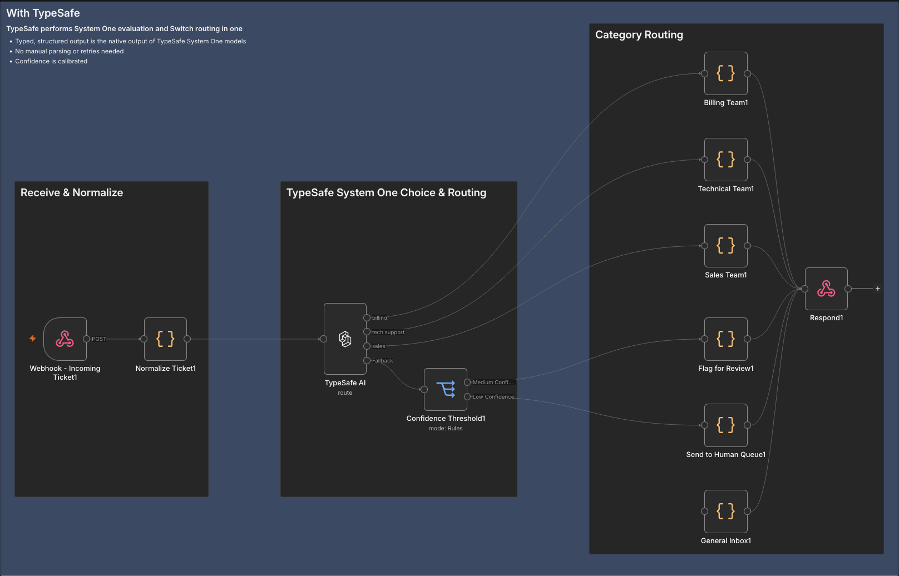

# @typesafe-ai/n8n-nodes-typesafe-ai

This n8n community node lets your workflows call TypeSafe AI's [System One models](https://docs.typesafe.ai/concepts/system-one). You give a System One model a [state](https://docs.typesafe.ai/concepts/state), which is the content you want judged, plus typed questions about it. The model returns a structured answer to each question, with probabilities. Jev is TypeSafe's flagship model and the first System One model.

The node has two operations. **Evaluate** adds the answers to each item. **Route** picks an output for each item based on the answer to one question.

[n8n](https://n8n.io/) is a [fair-code licensed](https://docs.n8n.io/choose-n8n/faircode-license/) workflow automation platform.

[Installation](#installation)
[Credentials](#credentials)
[Operations](#operations)
[Example workflow](#example-workflow)
[Output](#output)
[Errors](#errors)
[Compatibility](#compatibility)
[Resources](#resources)
[Version history](#version-history)

## Installation

Follow the [installation guide](https://docs.n8n.io/integrations/community-nodes/installation/) in the n8n community nodes documentation, and use the package name `@typesafe-ai/n8n-nodes-typesafe-ai`.

## Credentials

Create an API key in the [TypeSafe console](https://console.typesafe.ai/keys). In n8n, add a **TypeSafe AI API** credential and paste the key into **API Key**. n8n checks the key when you save the credential.

## Operations

Both operations send one request per input item. Each request includes the item's state, the selected **Model**, and the questions.

**State Format** sets where the state comes from:

| State Format | State sent |
| --- | --- |
| Text | The **State** field, as plain text |
| JSON | The **State** field, parsed as a JSON object or array |
| Input Item | The incoming item's JSON |

All the questions in a request are asked about the same state. The [State](https://docs.typesafe.ai/concepts/state) page covers how to structure it.

**Model** lists the models your API key can use. The [Models](https://docs.typesafe.ai/models) page describes each one and its aliases.

### Evaluate

Evaluate asks one or more questions about the state and adds all the answers to the item. Each question is one of TypeSafe's three [question types](https://docs.typesafe.ai/primitives):

| Question Type | Answer |
| --- | --- |
| [Choice](https://docs.typesafe.ai/primitives/choice) | The option the model picked from your list, and its [confidence](https://docs.typesafe.ai/confidence) |
| [Score](https://docs.typesafe.ai/primitives/score) | A position along your levels, and its confidence |
| [Noul (Yes/No)](https://docs.typesafe.ai/primitives/noul) | The probability that the answer is yes, from 0 to 1 |

You can build the questions with the node's fields. Or you can set **Questions Format** to **Using Raw JSON** and pass in a JSON object of questions in the API's format, such as one built by an earlier node. The [API reference](https://docs.typesafe.ai/api) documents that format.

Each answer goes in `answers`, under its question's **ID**:

```json
{
  "answers": {
    "is_urgent":   { "noul": 0.95 },
    "department":  { "choice": "billing", "confidence": 0.81 },
    "frustration": { "score": 1.05, "confidence": 0.92 }
  },
  "model": "jev-1.13.0"
}
```

When an AI Agent uses the node as a tool, the node runs Evaluate.

### Route

Route asks one question and sends the item to the output that matches the answer. **Question Type** sets the kind of question and the outputs you get:

| Question Type | Outputs | An item goes to |
| --- | --- | --- |
| Choice | One per route, labelled with its **Name** | The route the model picked |
| Noul (Yes/No) | True and False, labelled with **True Means** and **False Means** if you fill them in | True if at or above **True Probability Threshold**, False if at or below **False Probability Threshold** |
| Score | One per level, labelled with the level's text | The level nearest the score |

Each question type has its own way to add or change outputs:

- **Choice: Fallback output.** Set **Confidence Handling** to **Route to Separate Fallback Output** to add a `Fallback` output. An item goes there when its answer's confidence is below **Confidence Threshold**.
- **Noul: Uncertain output.** Both thresholds start at `0.5`, so every item goes to True or False. Set them apart, for example `0.8` and `0.2`, to add an `Uncertain` output for answers that fall between the two.
- **Score: level boundaries.** Levels are numbered from 0, lowest first. The boundary between two levels is halfway between their numbers. A score from `0.5` to just under `1.5` goes to level 1, and a score exactly on a boundary goes to the higher level.

The `route` field holds the answer in the same form Evaluate uses, and the output the item leaves from shows the decision.

```json
{ "route": { "choice": "billing", "confidence": 0.81 }, "model": "jev-1.13.0" }
```

## Example workflow

This workflow triages support tickets. A webhook receives each ticket, and the TypeSafe AI node's Route operation asks a Choice question with three routes: `billing`, `tech support` and `sales`. Each route's output leads to that team. **Confidence Handling** is set to **Route to Separate Fallback Output**, so a ticket answered below **Confidence Threshold** leaves from `Fallback` instead. A Switch node then sends it on by its confidence, either to be flagged for review or to a human queue.



## Output

The node writes these fields to each item:

| Field | Contents |
| --- | --- |
| `answers` | Evaluate: all the answers, keyed by question ID |
| `route` | Route: the answer to the route question |
| `model` | The full ID of the model that answered, including its version, such as `jev-1.13.0` |
| `usage` | Token usage, when **Simplify** is off |

Three settings under **Options** change how the node calls the API and what it writes:

- **Simplify** is on by default. It keeps each answer's `noul`, `choice` or `score`, plus `confidence` for question types that return it, under the API's field names. When it's off, each answer is the full answer object from the API, including `probabilities`, and the item also gets `usage`.
- **Include Other Input Fields** is on by default. It keeps the incoming item's fields and binary data, then writes the node's fields on top, replacing any incoming field with the same name. When it's off, the item has only the node's fields.
- **Timeout** is how long, in milliseconds, the node waits for the API to start responding. The default is 5000 and the minimum is 1000.

## Errors

When something goes wrong, the node stops and shows an error. A failed request shows the HTTP status and the API's error message. A setup problem, such as empty **Instructions** or a duplicate route name, shows a message saying what to fix.

In the node's **Settings**, turn on **Retry On Fail** to retry failed requests, including rate-limit errors (`429`).

To keep the workflow running when an item fails, set **On Error**:

- **Continue (using error output)** adds an error output to the node and sends each failed item there, with an `error` field.
- **Continue** sends each failed item, with an `error` field, to one of the node's regular outputs:

| Operation | Output the failed item goes to |
| --- | --- |
| Evaluate | The main output |
| Route, Choice | `Fallback` if there is one, otherwise the first route |
| Route, Noul (Yes/No) | `Uncertain` if there is one, otherwise False |
| Route, Score | The first level |

## Compatibility

Tested with n8n 2.40.

## Resources

* [TypeSafe AI quickstart](https://docs.typesafe.ai/introduction/quickstart)
* [TypeSafe AI documentation](https://docs.typesafe.ai)
* [TypeSafe AI API reference](https://docs.typesafe.ai/api)
* [n8n community nodes documentation](https://docs.n8n.io/integrations/#community-nodes)

## Version history

See [CHANGELOG.md](CHANGELOG.md).
